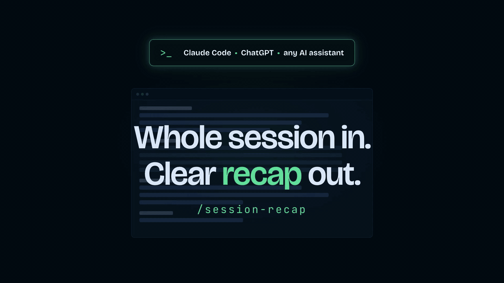

# Session Recap

> **Recap your AI coding session at a glance.**

Session Recap is a minimal reusable command that generates a readable recap of the current work session: what was done, in what order, where the project stands, and what to pick up next time.

It works in Claude Code, in Codex, in other AI coding assistants, and in regular AI chats.

## Why?

An AI coding session can quickly spread across several threads, fixes, and decisions. Without a recap, it is easy to lose track: what was done, in what order, what is still open.

Session Recap reads back the current conversation and produces a structured summary, so you can pick the work back up quickly, in the current session or the next one.

## Good for

Session Recap is useful when you want to:

* Quickly review what was done during a session.
* Understand the chronological flow of a long session.
* Know clearly where the project stands right now.
* Identify what to pick up in the next session.

## How to use it

Once installed, trigger it with the form native to your tool:

| Where | Trigger |
| --- | --- |
| Claude Code | `/session-recap` |
| Codex | `$session-recap` |
| Other AI coding assistants | the form created at install time |
| Regular AI chat | paste the chat version into the conversation |

## What Session Recap produces

Session Recap covers the work done since the last recap generated in the conversation, or otherwise since the start of the conversation. It does not summarize the full project history, and it does not invent actions, decisions, or timestamps.

It produces four sections:

* **Session Summary**: two sentences giving an overview.
* **Session Timeline**: a chronological table by topic, with timestamps.
* **Where the project stands**: a `✅ Done` / `🚧 In progress` / `❓ Open questions` table.
* **👉 Next step**: a single sentence on the most logical action to take next.

For a long session, the recap groups related actions into meaningful topics instead of logging everything: trivial commands, inconsequential exploration, and abandoned attempts with no impact are ignored.

## Example output

Here is a realistic example generated after improving the filters in a web dashboard: [Dashboard filters session recap](examples/dashboard-filters-session-recap.md).

It shows the complete output format: a two-sentence summary, a chronological timeline, the current project status, and one clear next step.

## How is this different from built-in recaps?

Claude Code has a built-in `/recap` that produces a one-line recap, either on demand or automatically when you come back after being away for a few minutes; it can be turned off in `/config`.

Codex has no session-recap command. The closest features serve a different purpose: `/compact` summarizes the conversation to stay under the context limit, and `/memories` distills sessions into long-term memory for future runs. Neither is meant to hand you a readable account of the session you just worked through.

Session Recap goes deeper, and behaves the same way in every tool: a full chronological breakdown, a project status table, and a next step, always in the same four sections.

## Limitations

Session Recap does not modify any project file: it only produces recap text.

The recap is based solely on the context actually available in the current conversation. It has no knowledge of past sessions that are not part of the current context, and it never invents a timestamp it cannot determine reliably.

## FAQ

**Does a recap carry over to a new conversation or chat?**
No. Everything is scoped to the current conversation, from its start or from the last recap generated inside it. Session Recap itself writes nothing to disk and shares nothing between conversations; a new chat starts from zero.

**Can I ask for a recap several times in the same session?**
Yes. Each recap is scoped to what happened since the previous one generated in that conversation, so recaps are not meant to overlap or repeat.

**What happens if the session is very long?**
The recap adapts its granularity: instead of logging everything, it groups related actions into roughly 8 to 12 meaningful topics and ignores trivial commands, inconsequential exploration, and abandoned attempts with no impact.

**What if part of the conversation was compacted or dropped from context (e.g. with `/compact`)?**
The recap can only work from what is actually present in the current context. If earlier parts of the conversation were compacted or fell out of context, they can't be reflected in the recap.

**Does it modify any files?**
No. Session Recap only produces recap text; it never edits, creates, or deletes project files.

**What if a timestamp can't be determined reliably?**
The cell is left empty. Session Recap is instructed to never invent a time it cannot determine from the conversation, so in practice the `Time` column can be partly or entirely empty depending on what the conversation exposes.

**What language is the recap in?**
The language you're using in the conversation; section headers and labels are translated accordingly.

## Install in Claude Code

### Method 1: let Claude Code install it

Paste this prompt in a Claude Code session:

[install-session-recap-for-claude-code.md](prompts-for-installation/install-session-recap-for-claude-code.md)

Claude Code asks whether to install it globally or in this project only, checks which format and location your version expects today, shows you the resolved path, then creates the files. Prefer the global install: Session Recap is a way of working, not project-specific content, so it is worth having in every session.

Then use it with:

```txt
/session-recap
```

### Method 2: manual

Claude Code has merged custom commands into skills: a file at `.claude/commands/session-recap.md` and a skill at `.claude/skills/session-recap/SKILL.md` both create `/session-recap` and behave the same way.

Copy [session-recap.md](.claude/commands/session-recap.md) into either location:

* **As a skill (current format)** — save it as `SKILL.md` inside `~/.claude/skills/session-recap/` for all your sessions, or inside your project's `.claude/skills/session-recap/` to version it with the repository.
* **As a command (still supported)** — drop the file as-is into `~/.claude/commands/`, or into your project's `.claude/commands/` folder.

Claude Code watches these folders and picks the change up without a restart. Only if the top-level skills folder did not exist when your session started do you need to restart Claude Code.

## Install and use in Codex

Session Recap ships as a native Codex skill in [`.agents/skills/session-recap`](.agents/skills/session-recap).

### Method 1: let Codex install it

Paste this prompt in a Codex session:

[install-session-recap-for-codex.md](prompts-for-installation/install-session-recap-for-codex.md)

Codex asks whether to install the skill globally or in the current project only, checks which format and location your version expects today, shows you the resolved path, then creates the files. The global install is recommended so Session Recap is available in every project.

Restart Codex or open a new chat, then invoke the skill:

```txt
$session-recap
```

Codex reserves root slash commands and does not support a custom `/session-recap` alias. `$session-recap` is the native reusable form and works across projects.

### Method 2: manual

Clone this repository, then link the skill into your user-level skills folder:

```sh
mkdir -p "$HOME/.agents/skills"
ln -s "$PWD/.agents/skills/session-recap" "$HOME/.agents/skills/session-recap"
```

Codex also discovers user skills under `~/.codex/skills`, but that location is deprecated and kept only for backward compatibility.

For a project-only install, `.agents/skills/session-recap` is already picked up when you work inside this repository.

A legacy custom-prompt file is also kept in [`.codex/prompts/session-recap.md`](.codex/prompts/session-recap.md) for older Codex versions that loaded reusable prompts from `~/.codex/prompts`. Recent versions no longer expose that mechanism, so use the skill.

## Using with other AI assistants

This repo is designed primarily for Claude Code and Codex. The same behavior can be reproduced with other AI assistants using the instructions in:

[install-session-recap-for-any-ai.md](prompts-for-installation/install-session-recap-for-any-ai.md)

Paste these instructions into the target assistant to let it recreate the Session Recap behavior in its own supported format. If the assistant supports a user-level location, it asks whether to install Session Recap globally or in the current project only.

## Use in a regular AI chat (ChatGPT, Claude, Gemini...)

If you just want to use Session Recap in a regular chat, without installing it in a project or a coding tool, paste this version into a conversation:

[session-recap-ai-chat-version.md](prompts-for-ai-chat/session-recap-ai-chat-version.md)

Once pasted, write exactly `recap` at any point in the conversation to get a recap of the current session. You can ask for it several times: each recap only covers what happened since the previous one.

This instruction only applies to the current conversation. If you open a new conversation, paste it again.

## Repository structure

```txt
session-recap/
├── README.md
├── LICENSE
├── .gitignore
├── .agents/
│   └── skills/
│       └── session-recap/
│           ├── SKILL.md
│           └── agents/
│               └── openai.yaml
├── .codex/
│   └── prompts/
│       └── session-recap.md
├── .claude/
│   └── commands/
│       └── session-recap.md
├── examples/
│   └── dashboard-filters-session-recap.md
├── prompts-for-installation/
│   ├── install-session-recap-for-claude-code.md
│   ├── install-session-recap-for-codex.md
│   └── install-session-recap-for-any-ai.md
├── prompts-for-ai-chat/
│   └── session-recap-ai-chat-version.md
└── public/
    ├── session-recap.png
    ├── session-recap.gif
    └── session-recap.mp4
```

## More AI workflow commands

Small, portable commands for Claude Code, Codex, and any AI assistant.

| Command | What it does |
| --- | --- |
| [WaitGo](https://github.com/arthurglaizal/wait-go) | Batches your instructions, then executes only when you say go. |
| [AI Handoff](https://github.com/arthurglaizal/ai-handoff) | Packages the current context so another AI can continue the work. |
| [Noob Command](https://github.com/arthurglaizal/noob-command) | Rewrites the last AI answer in simple, concise language. |
| [Ask Mode](https://github.com/arthurglaizal/ask-mode) | Lets you question your codebase without the assistant changing anything. |

## Support
If you find my work useful, you can [buy me a coffee](https://ko-fi.com/arturo_ux) ☕️

## License

MIT — see [LICENSE](LICENSE).
